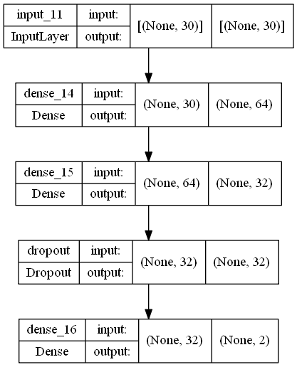
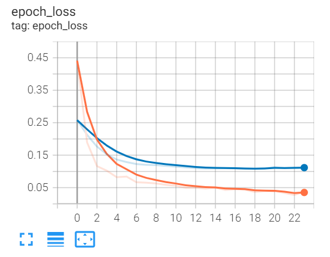
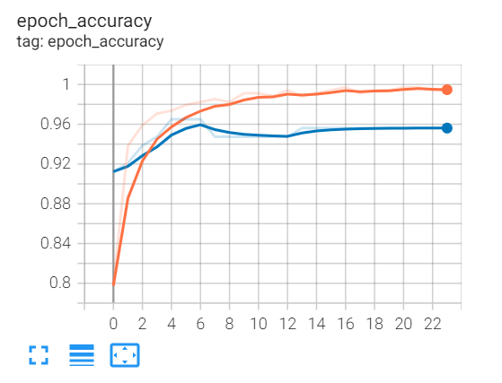

# Breast Cancer Prediction Using Feedforward Neural Network
## 1. Summary
The aim of this project is to create a highly accurate deep learning model to predict breast cancer (whether the tumour is malignant or benign). The model is trained with [Wisconsin Breast Cancer Dataset](https://www.kaggle.com/datasets/uciml/breast-cancer-wisconsin-data)

## 2. IDE and Framework
This project is created using Sypder as the main IDE. The main frameworks used in this project are Pandas, Scikit-learn and TensorFlow Keras.

## 3. Methodology
### 3.1. Data Pipeline
The data is first loaded and preprocessed, such that unwanted features are removed, and label is encoded in one-hot format. Then the data is split into train-validation-test sets, with a ratio of 60:20:20.

### 3.2. Model Pipeline
A feedforward neural network is constructed that is catered for classification problem. The structure of the model is fairly simple. Figure below shows the structure of the model.

The model is trained with a batch size of 32 and for 100 epochs. Early stopping is applied in this training. The training stops at epoch 24, with a training accuracy of 99% and validation accuracy of 95%. The two figures below show the graph of the training process.

 

## 4. Results
Upon evaluating the model with test data, the model obtain the following test results, as shown in figure below.

